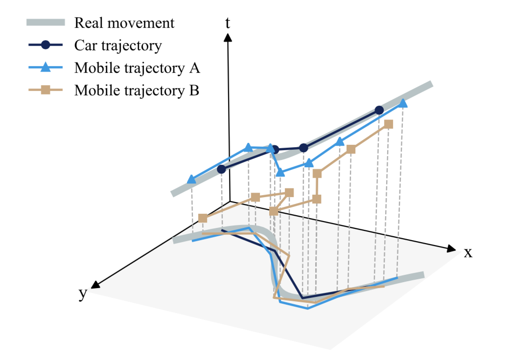
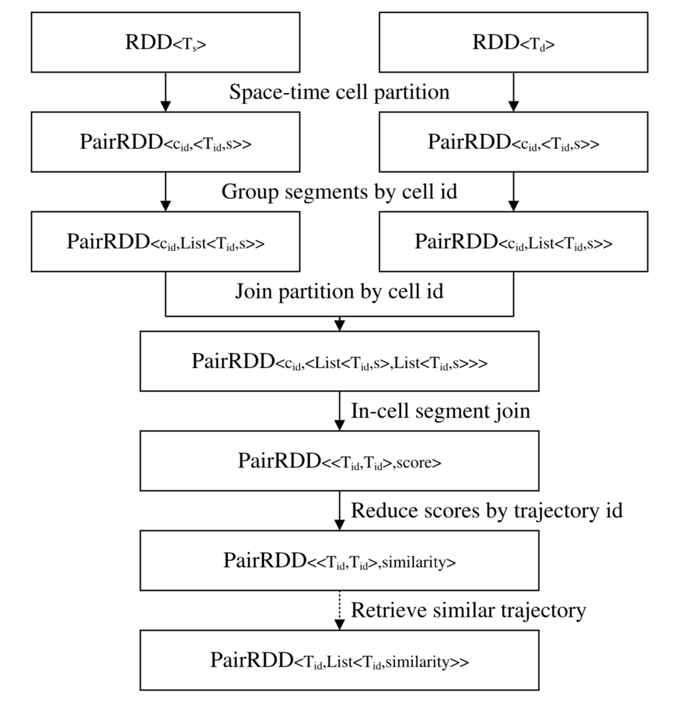

# TrajectoryMatching

**Title:** High-performance spatiotemporal trajectory matching across heterogeneous data sources

**Abstract:** In the era of big data, the movement of the same object or person can be recorded by different devices with different measurement accuracies and sampling rates. Matching and conflating these heterogeneous trajectories help to enhance trajectory semantics, describe user portraits, and discover specified groups from human mobility. In this paper, we proposed a high-performance approach for matching spatiotemporal trajectories across heterogeneous massive datasets. Two indicators, i.e., Time Weighted Similarity (TWS) and Space Weighted Similarity (SWS), are proposed to measure the similarity of spatiotemporal trajectories. The core idea is that trajectories are more similar if they stay close in a longer time and distance. A distributed computing framework based on Spark is built for efficient trajectory matching among massive datasets. In the framework, the trajectory segments are partitioned into 3-dimensional space–time cells for parallel processing, and a novel method of segment reference point is designed to avoid duplicated computation. We conducted extensive matching experiments on real-world and synthetic trajectory datasets. The experimental results illustrate that the proposed approach outperforms other similarity metrics in accuracy, and the Spark-based framework greatly improves the efficiency in spatiotemporal trajectory matching.

## Code

This framework is written in Python with PySpark. The [pypy interpreter](https://pypy.org/) is highly recommended to accelerate the computation. The utils folder contains the Time Weighted Similarity (TWS) and Space Weighted Similarity (SWS) algorithm. `trajectory_matching.py` contains all the code for distributed matching.

Below is the overall process of the framework:

## Cite

Please consider citing our paper if this helps in your work:

Xuri Gong, Zhou Huang, Yaoli Wang, Lun Wu, & Yu Liu (2020). High-performance spatiotemporal trajectory matching across heterogeneous data sourcesFuture Generation Computer Systems, 105, 148 - 161.

@article{GONG2020148,
title = "High-performance spatiotemporal trajectory matching across heterogeneous data sources",
journal = "Future Generation Computer Systems",
volume = "105",
pages = "148 - 161",
year = "2020",
issn = "0167-739X",
doi = "https://doi.org/10.1016/j.future.2019.11.027",
url = "http://www.sciencedirect.com/science/article/pii/S0167739X19319880",
author = "Xuri Gong and Zhou Huang and Yaoli Wang and Lun Wu and Yu Liu",
}

